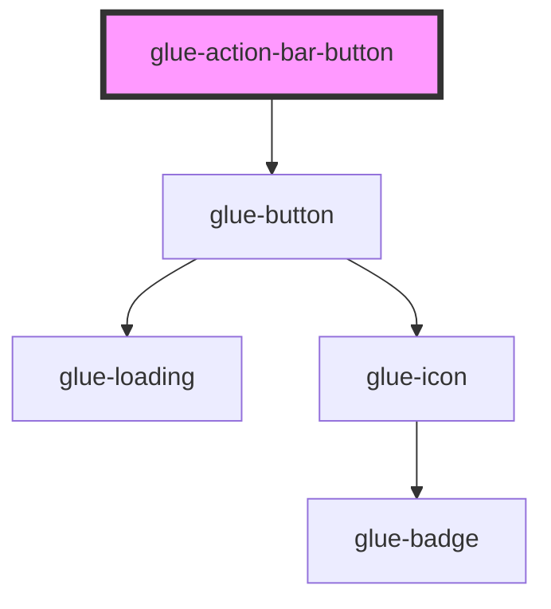

# glue-action-bar-button

<!-- Auto Generated Below -->

## Properties

| Property     | Attribute     | Description | Type      | Default     |
| ------------ | ------------- | ----------- | --------- | ----------- |
| `color`      | `color`       |             | `string`  | `undefined` |
| `disabled`   | `disabled`    |             | `boolean` | `undefined` |
| `icon`       | `icon`        |             | `string`  | `undefined` |
| `leftRound`  | `left-round`  |             | `boolean` | `undefined` |
| `loading`    | `loading`     |             | `boolean` | `undefined` |
| `rightRound` | `right-round` |             | `boolean` | `undefined` |
| `text`       | `text`        |             | `string`  | `undefined` |
| `type`       | `type`        |             | `string`  | `undefined` |

## Events

| Event     | Description | Type               |
| --------- | ----------- | ------------------ |
| `onClick` |             | `CustomEvent<any>` |

## Dependencies

### Depends on

- [glue-button](../glue-button)

### Graph

---

_Built with [StencilJS](https://stenciljs.com/)_
