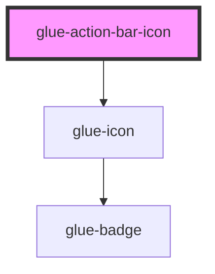

# glue-action-bar-icon

<!-- Auto Generated Below -->

## Properties

| Property    | Attribute | Description | Type               | Default     |
| ----------- | --------- | ----------- | ------------------ | ----------- |
| `badge`     | `badge`   |             | `number \| string` | `undefined` |
| `color`     | `color`   |             | `string`           | `undefined` |
| `dot`       | `dot`     |             | `boolean`          | `undefined` |
| `icon`      | `icon`    |             | `string`           | `undefined` |
| `iconClass` | --        |             | `null`             | `undefined` |
| `text`      | `text`    |             | `string`           | `undefined` |

## Events

| Event     | Description | Type               |
| --------- | ----------- | ------------------ |
| `onClick` |             | `CustomEvent<any>` |

## Dependencies

### Depends on

- [glue-icon](../glue-icon)

### Graph

---

_Built with [StencilJS](https://stenciljs.com/)_
