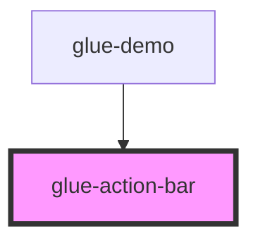

# glue-action-bar

<!-- Auto Generated Below -->

## Properties

| Property              | Attribute                | Description | Type      | Default     |
| --------------------- | ------------------------ | ----------- | --------- | ----------- |
| `safeAreaInsetBottom` | `safe-area-inset-bottom` |             | `boolean` | `undefined` |

## Dependencies

### Used by

 - [glue-demo](../glue-demo)

### Graph

----------------------------------------------

*Built with [StencilJS](https://stenciljs.com/)*
