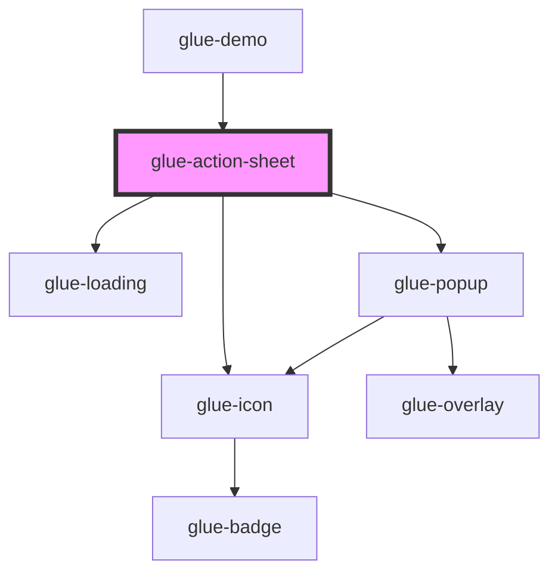

# glue-action-sheet

<!-- Auto Generated Below -->

## Properties

| Property              | Attribute                | Description | Type      | Default     |
| --------------------- | ------------------------ | ----------- | --------- | ----------- |
| `actions`             | `actions`                |             | `any`     | `undefined` |
| `cancelText`          | `cancel-text`            |             | `string`  | `undefined` |
| `closeIcon`           | `close-icon`             |             | `string`  | `'cross'`   |
| `closeOnClickAction`  | `close-on-click-action`  |             | `boolean` | `undefined` |
| `closeOnClickOverlay` | `close-on-click-overlay` |             | `boolean` | `true`      |
| `closeable`           | `closeable`              |             | `boolean` | `undefined` |
| `description`         | `description`            |             | `string`  | `undefined` |
| `duration`            | `duration`               |             | `string`  | `undefined` |
| `lazyRender`          | `lazy-render`            |             | `boolean` | `true`      |
| `lockScroll`          | `lock-scroll`            |             | `boolean` | `true`      |
| `overlay`             | `overlay`                |             | `boolean` | `true`      |
| `round`               | `round`                  |             | `boolean` | `true`      |
| `safeAreaInsetBottom` | `safe-area-inset-bottom` |             | `boolean` | `false`     |
| `show`                | `show`                   |             | `boolean` | `undefined` |
| `title`               | `title`                  |             | `string`  | `undefined` |

## Events

| Event        | Description | Type               |
| ------------ | ----------- | ------------------ |
| `glueCancel` |             | `CustomEvent<any>` |
| `glueClose`  |             | `CustomEvent<any>` |
| `glueClosed` |             | `CustomEvent<any>` |
| `glueOpen`   |             | `CustomEvent<any>` |
| `glueOpened` |             | `CustomEvent<any>` |
| `glueShow`   |             | `CustomEvent<any>` |

## Dependencies

### Used by

 - [glue-demo](../glue-demo)

### Depends on

- [glue-icon](../glue-icon)
- [glue-loading](../glue-loading)
- [glue-popup](../glue-popup)

### Graph

----------------------------------------------

*Built with [StencilJS](https://stenciljs.com/)*
