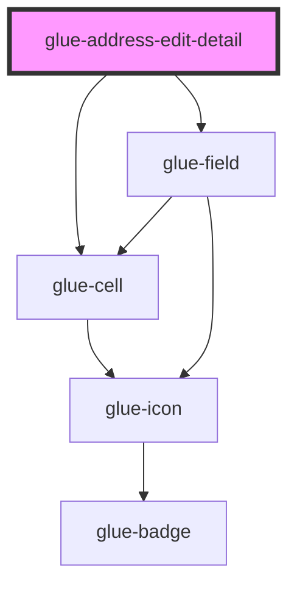

# glue-address-edit-detail

<!-- Auto Generated Below -->

## Properties

| Property           | Attribute            | Description | Type               | Default     |
| ------------------ | -------------------- | ----------- | ------------------ | ----------- |
| `detailMaxlength`  | `detail-maxlength`   |             | `number \| string` | `undefined` |
| `detailRows`       | `detail-rows`        |             | `number \| string` | `undefined` |
| `errorMessage`     | `error-message`      |             | `string`           | `undefined` |
| `first`            | `first`              |             | `string`           | `undefined` |
| `focused`          | `focused`            |             | `boolean`          | `undefined` |
| `searchResult`     | `search-result`      |             | `any`              | `undefined` |
| `show`             | `show`               |             | `boolean`          | `undefined` |
| `showSearchResult` | `show-search-result` |             | `boolean`          | `undefined` |
| `value`            | `value`              |             | `string`           | `undefined` |

## Events

| Event       | Description | Type               |
| ----------- | ----------- | ------------------ |
| `glueBlur`  |             | `CustomEvent<any>` |
| `glueFocus` |             | `CustomEvent<any>` |
| `glueInput` |             | `CustomEvent<any>` |

## Dependencies

### Depends on

- [glue-cell](../glue-cell)
- [glue-field](../glue-field)

### Graph

---

_Built with [StencilJS](https://stenciljs.com/)_
