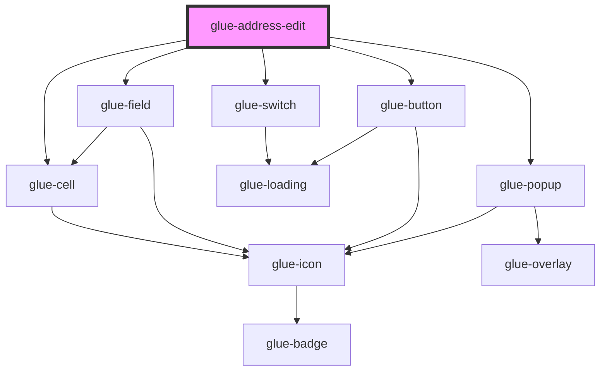

# glue-address-edit

<!-- Auto Generated Below -->

## Properties

| Property                 | Attribute            | Description | Type                                                                                                                                                                               | Default              |
| ------------------------ | -------------------- | ----------- | ---------------------------------------------------------------------------------------------------------------------------------------------------------------------------------- | -------------------- |
| `addressInfo`            | --                   |             | `{ name: string; tel: string; country: string; province: string; city: string; county: string; areaCode: string; postalCode: string; addressDetail: string; isDefault: boolean; }` | `{ ...defaultData }` |
| `areaColumnsPlaceholder` | --                   |             | `any[]`                                                                                                                                                                            | `[]`                 |
| `areaList`               | `area-list`          |             | `any`                                                                                                                                                                              | `undefined`          |
| `areaPlaceholder`        | `area-placeholder`   |             | `string`                                                                                                                                                                           | `undefined`          |
| `deleteButtonText`       | `delete-button-text` |             | `string`                                                                                                                                                                           | `undefined`          |
| `detailMaxlength`        | `detail-maxlength`   |             | `number`                                                                                                                                                                           | `200`                |
| `detailRows`             | `detail-rows`        |             | `number`                                                                                                                                                                           | `1`                  |
| `disableArea`            | `disable-area`       |             | `boolean`                                                                                                                                                                          | `undefined`          |
| `isDeleting`             | `is-deleting`        |             | `boolean`                                                                                                                                                                          | `undefined`          |
| `isSaving`               | `is-saving`          |             | `boolean`                                                                                                                                                                          | `undefined`          |
| `postalValidator`        | --                   |             | `(value: any) => boolean`                                                                                                                                                          | `isPostal`           |
| `saveButtonText`         | `save-button-text`   |             | `string`                                                                                                                                                                           | `undefined`          |
| `searchResult`           | --                   |             | `[]`                                                                                                                                                                               | `undefined`          |
| `showArea`               | `show-area`          |             | `boolean`                                                                                                                                                                          | `true`               |
| `showDelete`             | `show-delete`        |             | `boolean`                                                                                                                                                                          | `undefined`          |
| `showDetail`             | `show-detail`        |             | `boolean`                                                                                                                                                                          | `true`               |
| `showPostal`             | `show-postal`        |             | `boolean`                                                                                                                                                                          | `undefined`          |
| `showSearchResult`       | `show-search-result` |             | `string`                                                                                                                                                                           | `undefined`          |
| `showSetDefault`         | `show-set-default`   |             | `boolean`                                                                                                                                                                          | `undefined`          |
| `telMaxlength`           | `tel-maxlength`      |             | `number \| string`                                                                                                                                                                 | `undefined`          |
| `telValidator`           | --                   |             | `(value: string) => boolean`                                                                                                                                                       | `isMobile`           |
| `validator`              | `validator`          |             | `any`                                                                                                                                                                              | `undefined`          |

## Dependencies

### Depends on

- [glue-switch](../glue-switch)
- [glue-cell](../glue-cell)
- [glue-field](../glue-field)
- [glue-button](../glue-button)
- [glue-popup](../glue-popup)

### Graph

----------------------------------------------

*Built with [StencilJS](https://stenciljs.com/)*
