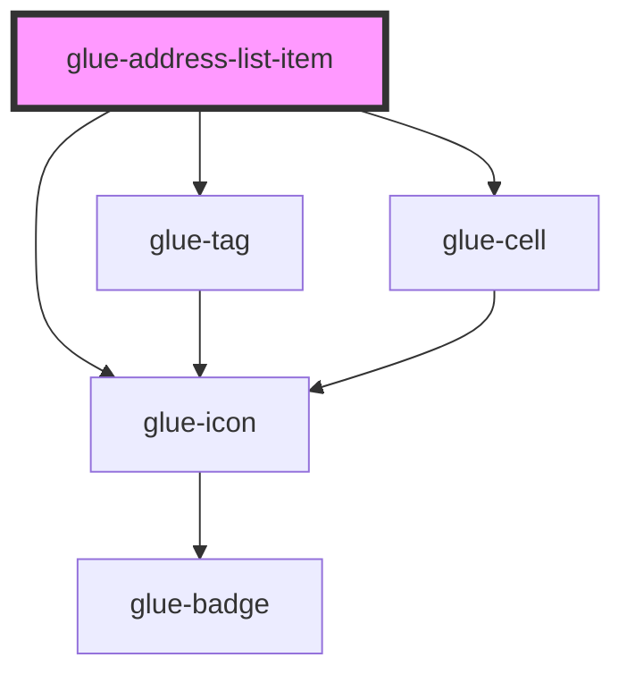

# glue-address-list-item

<!-- Auto Generated Below -->

## Properties

| Property         | Attribute          | Description | Type      | Default     |
| ---------------- | ------------------ | ----------- | --------- | ----------- |
| `data`           | `data`             |             | `any`     | `undefined` |
| `defaultTagText` | `default-tag-text` |             | `string`  | `undefined` |
| `disabled`       | `disabled`         |             | `boolean` | `undefined` |
| `switchable`     | `switchable`       |             | `boolean` | `undefined` |

## Dependencies

### Depends on

- [glue-icon](../glue-icon)
- [glue-tag](../glue-tag)
- [glue-cell](../glue-cell)

### Graph

----------------------------------------------

*Built with [StencilJS](https://stenciljs.com/)*
