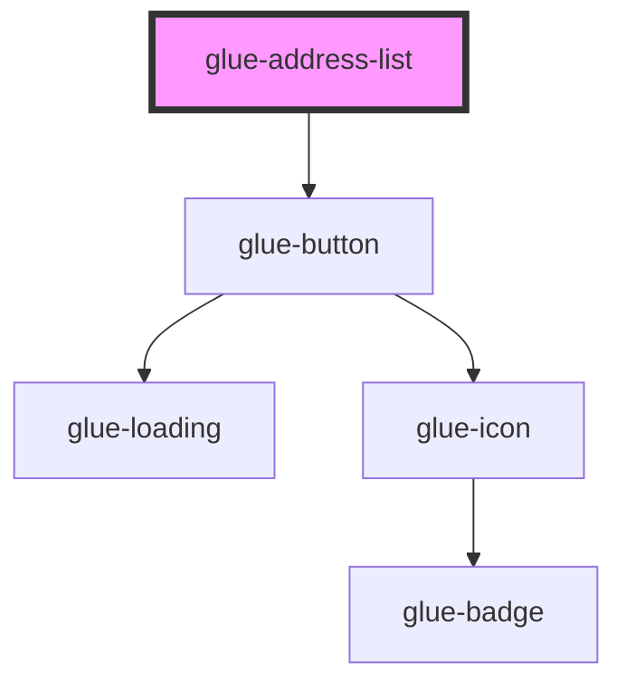

# glue-address-list

<!-- Auto Generated Below -->

## Properties

| Property         | Attribute          | Description | Type               | Default     |
| ---------------- | ------------------ | ----------- | ------------------ | ----------- |
| `addButtonText`  | `add-button-text`  |             | `string`           | `undefined` |
| `defaultTagText` | `default-tag-text` |             | `string`           | `undefined` |
| `disabledList`   | `disabled-list`    |             | `any`              | `undefined` |
| `disabledText`   | `disabled-text`    |             | `string`           | `undefined` |
| `list`           | `list`             |             | `any`              | `undefined` |
| `modelValue`     | `model-value`      |             | `number \| string` | `undefined` |
| `switchable`     | `switchable`       |             | `boolean`          | `true`      |

## Dependencies

### Depends on

- [glue-button](../glue-button)

### Graph

----------------------------------------------

*Built with [StencilJS](https://stenciljs.com/)*
