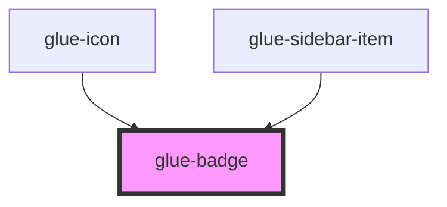

# glue-badge

<!-- Auto Generated Below -->

## Properties

| Property  | Attribute | Description | Type               | Default     |
| --------- | --------- | ----------- | ------------------ | ----------- |
| `color`   | `color`   |             | `string`           | `undefined` |
| `content` | `content` |             | `number \| string` | `undefined` |
| `dot`     | `dot`     |             | `boolean`          | `undefined` |
| `max`     | `max`     |             | `number \| string` | `undefined` |
| `tag`     | `tag`     |             | `string`           | `'dev'`     |

## Dependencies

### Used by

 - [glue-icon](../glue-icon)
 - [glue-sidebar-item](../glue-sidebar-item)

### Graph

----------------------------------------------

*Built with [StencilJS](https://stenciljs.com/)*
