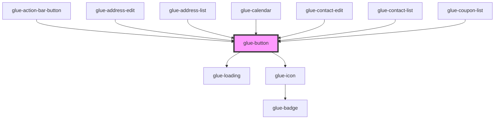

# glue-button

<!-- Auto Generated Below -->

## Properties

| Property       | Attribute       | Description | Type      | Default     |
| -------------- | --------------- | ----------- | --------- | ----------- |
| `block`        | `block`         |             | `boolean` | `undefined` |
| `color`        | `color`         |             | `string`  | `undefined` |
| `disabled`     | `disabled`      |             | `boolean` | `undefined` |
| `hairline`     | `hairline`      |             | `boolean` | `undefined` |
| `icon`         | `icon`          |             | `string`  | `undefined` |
| `iconPosition` | `icon-position` |             | `string`  | `'left'`    |
| `iconPrefix`   | `icon-prefix`   |             | `string`  | `undefined` |
| `loading`      | `loading`       |             | `boolean` | `undefined` |
| `loadingSize`  | `loading-size`  |             | `string`  | `'20px'`    |
| `loadingText`  | `loading-text`  |             | `string`  | `undefined` |
| `loadingType`  | `loading-type`  |             | `string`  | `undefined` |
| `nativeType`   | `native-type`   |             | `string`  | `'button'`  |
| `plain`        | `plain`         |             | `boolean` | `undefined` |
| `round`        | `round`         |             | `boolean` | `undefined` |
| `size`         | `size`          |             | `string`  | `'normal'`  |
| `square`       | `square`        |             | `boolean` | `undefined` |
| `tag`          | `tag`           |             | `string`  | `'button'`  |
| `text`         | `text`          |             | `string`  | `undefined` |
| `type`         | `type`          |             | `string`  | `'default'` |

## Events

| Event       | Description | Type               |
| ----------- | ----------- | ------------------ |
| `glueClick` |             | `CustomEvent<any>` |

## Dependencies

### Used by

- [glue-action-bar-button](../glue-action-bar-button)
- [glue-address-edit](../glue-address-edit)
- [glue-address-list](../glue-address-list)
- [glue-calendar](../glue-calendar)
- [glue-contact-edit](../glue-contact-edit)
- [glue-contact-list](../glue-contact-list)
- [glue-coupon-list](../glue-coupon-list)

### Depends on

- [glue-loading](../glue-loading)
- [glue-icon](../glue-icon)

### Graph

---

_Built with [StencilJS](https://stenciljs.com/)_
