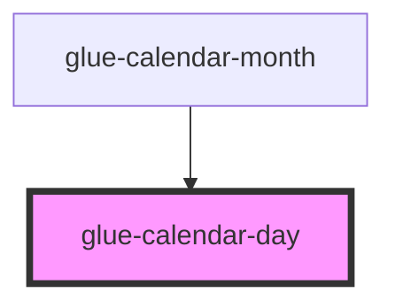

# glue-calendar-day

<!-- Auto Generated Below -->

## Properties

| Property    | Attribute    | Description | Type     | Default     |
| ----------- | ------------ | ----------- | -------- | ----------- |
| `color`     | `color`      |             | `string` | `undefined` |
| `index`     | `index`      |             | `number` | `undefined` |
| `item`      | `item`       |             | `any`    | `undefined` |
| `offset`    | `offset`     |             | `number` | `undefined` |
| `rowHeight` | `row-height` |             | `string` | `undefined` |

## Events

| Event          | Description | Type               |
| -------------- | ----------- | ------------------ |
| `glueDayClick` |             | `CustomEvent<any>` |

## Dependencies

### Used by

 - [glue-calendar-month](../glue-calendar-month)

### Graph

----------------------------------------------

*Built with [StencilJS](https://stenciljs.com/)*
