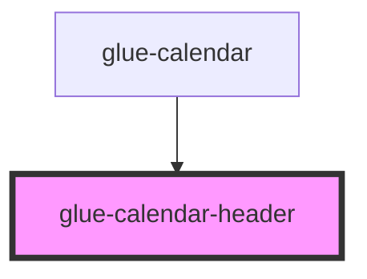

# glue-calendar-header

<!-- Auto Generated Below -->

## Properties

| Property         | Attribute           | Description | Type      | Default     |
| ---------------- | ------------------- | ----------- | --------- | ----------- |
| `first`          | `first`             |             | `string`  | `undefined` |
| `firstDayOfWeek` | `first-day-of-week` |             | `number`  | `undefined` |
| `showSubtitle`   | `show-subtitle`     |             | `boolean` | `undefined` |
| `showTitle`      | `show-title`        |             | `boolean` | `undefined` |
| `subtitle`       | `subtitle`          |             | `string`  | `undefined` |
| `title`          | `title`             |             | `string`  | `undefined` |

## Dependencies

### Used by

- [glue-calendar](../glue-calendar)

### Graph

---

_Built with [StencilJS](https://stenciljs.com/)_
