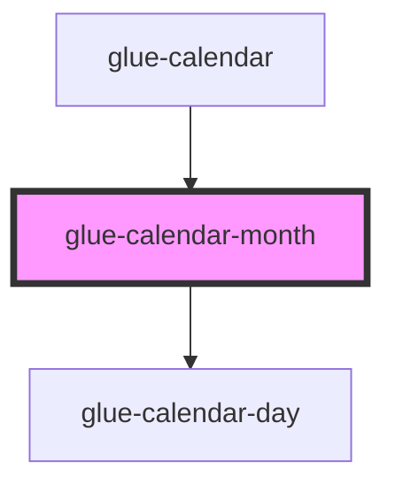

# glue-calendar-month

<!-- Auto Generated Below -->

## Properties

| Property         | Attribute           | Description | Type      | Default     |
| ---------------- | ------------------- | ----------- | --------- | ----------- |
| `allowSameDay`   | `allow-same-day`    |             | `boolean` | `undefined` |
| `color`          | `color`             |             | `string`  | `undefined` |
| `currentDate`    | `current-date`      |             | `any`     | `undefined` |
| `date`           | `date`              |             | `any`     | `undefined` |
| `firstDayOfWeek` | `first-day-of-week` |             | `number`  | `undefined` |
| `formatter`      | `formatter`         |             | `any`     | `undefined` |
| `lazyRender`     | `lazy-render`       |             | `boolean` | `undefined` |
| `maxDate`        | `max-date`          |             | `any`     | `undefined` |
| `minDate`        | `min-date`          |             | `any`     | `undefined` |
| `rowHeight`      | `row-height`        |             | `string`  | `undefined` |
| `showMark`       | `show-mark`         |             | `boolean` | `undefined` |
| `showMonthTitle` | `show-month-title`  |             | `boolean` | `undefined` |
| `showSubtitle`   | `show-subtitle`     |             | `boolean` | `undefined` |
| `type`           | `type`              |             | `string`  | `undefined` |

## Events

| Event            | Description | Type               |
| ---------------- | ----------- | ------------------ |
| `glueMonthClick` |             | `CustomEvent<any>` |

## Methods

### `getTitle() => Promise<string>`

#### Returns

Type: `Promise<string>`

## Dependencies

### Used by

- [glue-calendar](../glue-calendar)

### Depends on

- [glue-calendar-day](../glue-calendar-day)

### Graph

---

_Built with [StencilJS](https://stenciljs.com/)_
