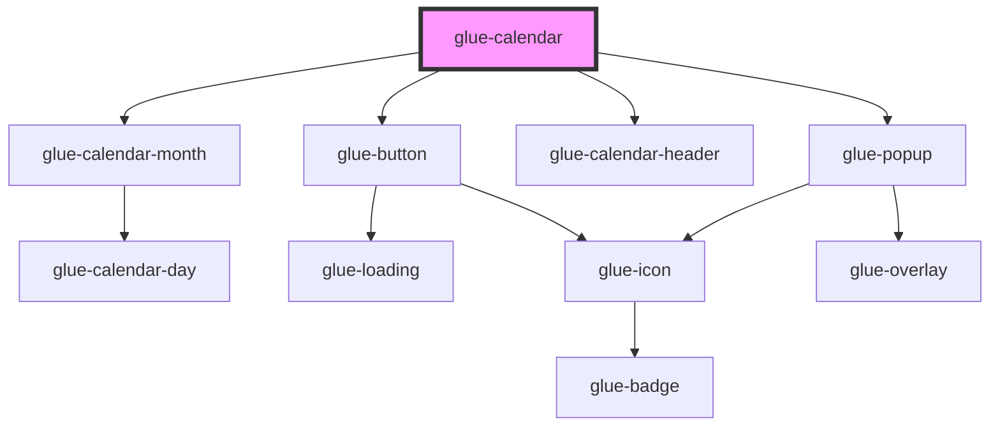

# glue-calendar

<!-- Auto Generated Below -->

## Properties

| Property              | Attribute                | Description | Type               | Default                                                          |
| --------------------- | ------------------------ | ----------- | ------------------ | ---------------------------------------------------------------- |
| `allowSameDay`        | `allow-same-day`         |             | `boolean`          | `undefined`                                                      |
| `closeOnClickOverlay` | `close-on-click-overlay` |             | `boolean`          | `false`                                                          |
| `closeOnPopstate`     | `close-on-popstate`      |             | `boolean`          | `false`                                                          |
| `color`               | `color`                  |             | `string`           | `undefined`                                                      |
| `confirmDisabledText` | `confirm-disabled-text`  |             | `string`           | `undefined`                                                      |
| `confirmText`         | `confirm-text`           |             | `string`           | `'确定'`                                                           |
| `defaultDate`         | `default-date`           |             | `any`              | `undefined`                                                      |
| `first`               | `first`                  |             | `string`           | `undefined`                                                      |
| `firstDayOfWeek`      | `first-day-of-week`      |             | `any`              | `0`                                                              |
| `footer`              | `footer`                 |             | `string`           | `''`                                                             |
| `formatter`           | `formatter`              |             | `any`              | `undefined`                                                      |
| `lazyRender`          | `lazy-render`            |             | `boolean`          | `false`                                                          |
| `maxDate`             | --                       |             | `Date`             | `new Date(now.getFullYear(), now.getMonth() + 6, now.getDate())` |
| `maxRange`            | `max-range`              |             | `any`              | `undefined`                                                      |
| `minDate`             | --                       |             | `Date`             | `new Date()`                                                     |
| `poppable`            | `poppable`               |             | `boolean`          | `false`                                                          |
| `position`            | `position`               |             | `string`           | `'bottom'`                                                       |
| `rangePrompt`         | `range-prompt`           |             | `string`           | `undefined`                                                      |
| `readonly`            | `readonly`               |             | `boolean`          | `undefined`                                                      |
| `round`               | `round`                  |             | `boolean`          | `false`                                                          |
| `rowHeight`           | `row-height`             |             | `number \| string` | `undefined`                                                      |
| `safeAreaInsetBottom` | `safe-area-inset-bottom` |             | `boolean`          | `false`                                                          |
| `show`                | `show`                   |             | `boolean`          | `undefined`                                                      |
| `showConfirm`         | `show-confirm`           |             | `boolean`          | `false`                                                          |
| `showMark`            | `show-mark`              |             | `boolean`          | `false`                                                          |
| `showSubtitle`        | `show-subtitle`          |             | `boolean`          | `false`                                                          |
| `showTitle`           | `show-title`             |             | `boolean`          | `false`                                                          |
| `teleport`            | `teleport`               |             | `any`              | `undefined`                                                      |
| `title`               | `title`                  |             | `string`           | `undefined`                                                      |
| `type`                | `type`                   |             | `string`           | `'single'`                                                       |

## Events

| Event           | Description | Type               |
| --------------- | ----------- | ------------------ |
| `glueClose`     |             | `CustomEvent<any>` |
| `glueClosed`    |             | `CustomEvent<any>` |
| `glueConfirm`   |             | `CustomEvent<any>` |
| `glueMonthShow` |             | `CustomEvent<any>` |
| `glueOpen`      |             | `CustomEvent<any>` |
| `glueOpened`    |             | `CustomEvent<any>` |
| `glueSelect`    |             | `CustomEvent<any>` |
| `glueUnselect`  |             | `CustomEvent<any>` |

## Dependencies

### Depends on

- [glue-calendar-month](../glue-calendar-month)
- [glue-button](../glue-button)
- [glue-calendar-header](../glue-calendar-header)
- [glue-popup](../glue-popup)

### Graph

----------------------------------------------

*Built with [StencilJS](https://stenciljs.com/)*
