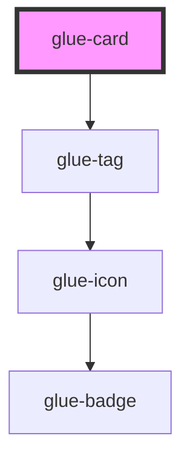

# glue-card

<!-- Auto Generated Below -->

## Properties

| Property      | Attribute      | Description | Type               | Default     |
| ------------- | -------------- | ----------- | ------------------ | ----------- |
| `centered`    | `centered`     |             | `boolean`          | `undefined` |
| `currency`    | `currency`     |             | `string`           | `'¥'`       |
| `desc`        | `desc`         |             | `string`           | `undefined` |
| `lazyLoad`    | `lazy-load`    |             | `boolean`          | `undefined` |
| `num`         | `num`          |             | `number \| string` | `undefined` |
| `originPrice` | `origin-price` |             | `number \| string` | `undefined` |
| `price`       | `price`        |             | `number \| string` | `undefined` |
| `tag`         | `tag`          |             | `string`           | `undefined` |
| `thumb`       | `thumb`        |             | `string`           | `undefined` |
| `thumbLink`   | `thumb-link`   |             | `string`           | `undefined` |
| `title`       | `title`        |             | `string`           | `undefined` |

## Events

| Event            | Description | Type               |
| ---------------- | ----------- | ------------------ |
| `checkboxchange` |             | `CustomEvent<any>` |

## Dependencies

### Depends on

- [glue-tag](../glue-tag)

### Graph

----------------------------------------------

*Built with [StencilJS](https://stenciljs.com/)*
