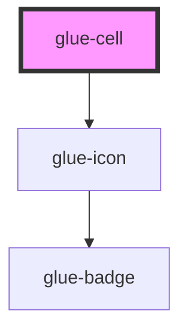

# glue-cell

<!-- Auto Generated Below -->

## Properties

| Property          | Attribute          | Description | Type               | Default     |
| ----------------- | ------------------ | ----------- | ------------------ | ----------- |
| `arrowDirection`  | `arrow-direction`  |             | `string`           | `undefined` |
| `border`          | `border`           |             | `boolean`          | `true`      |
| `center`          | `center`           |             | `boolean`          | `undefined` |
| `clickable`       | `clickable`        |             | `boolean`          | `undefined` |
| `icon`            | `icon`             |             | `string`           | `undefined` |
| `iconPrefix`      | `icon-prefix`      |             | `string`           | `undefined` |
| `isLink`          | `is-link`          |             | `boolean`          | `undefined` |
| `label`           | `label`            |             | `number \| string` | `undefined` |
| `required`        | `required`         |             | `boolean`          | `undefined` |
| `size`            | `size`             |             | `string`           | `undefined` |
| `tilabelClasstle` | `tilabel-classtle` |             | `any`              | `null`      |
| `title`           | `title`            |             | `string`           | `undefined` |
| `titleClass`      | `title-class`      |             | `any`              | `null`      |
| `titleStyle`      | `title-style`      |             | `any`              | `null`      |
| `value`           | `value`            |             | `number \| string` | `undefined` |
| `valueClass`      | `value-class`      |             | `any`              | `null`      |

## Events

| Event            | Description | Type               |
| ---------------- | ----------- | ------------------ |
| `checkboxchange` |             | `CustomEvent<any>` |

## Dependencies

### Depends on

- [glue-icon](../glue-icon)

### Graph

----------------------------------------------

*Built with [StencilJS](https://stenciljs.com/)*
