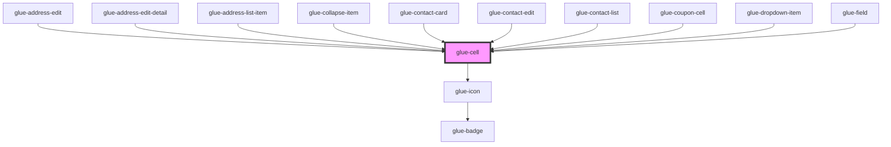

# glue-cell

<!-- Auto Generated Below -->

## Properties

| Property          | Attribute          | Description | Type                                  | Default     |
| ----------------- | ------------------ | ----------- | ------------------------------------- | ----------- |
| `arrowDirection`  | `arrow-direction`  |             | `"down" \| "left" \| "right" \| "up"` | `undefined` |
| `border`          | `border`           |             | `boolean`                             | `true`      |
| `center`          | `center`           |             | `boolean`                             | `undefined` |
| `clickable`       | `clickable`        |             | `boolean`                             | `undefined` |
| `g_title`         | `g_title`          |             | `string`                              | `undefined` |
| `icon`            | `icon`             |             | `string`                              | `undefined` |
| `iconPrefix`      | `icon-prefix`      |             | `string`                              | `undefined` |
| `isLink`          | `is-link`          |             | `boolean`                             | `undefined` |
| `label`           | `label`            |             | `number \| string`                    | `undefined` |
| `required`        | `required`         |             | `boolean`                             | `undefined` |
| `rightIcon`       | `right-icon`       |             | `string`                              | `undefined` |
| `size`            | `size`             |             | `string`                              | `undefined` |
| `tilabelClasstle` | `tilabel-classtle` |             | `any`                                 | `null`      |
| `titleClass`      | `title-class`      |             | `any`                                 | `null`      |
| `titleStyle`      | `title-style`      |             | `any`                                 | `null`      |
| `value`           | `value`            |             | `number \| string`                    | `undefined` |
| `valueClass`      | `value-class`      |             | `any`                                 | `null`      |

## Dependencies

### Used by

- [glue-address-edit](../glue-address-edit)
- [glue-address-edit-detail](../glue-address-edit-detail)
- [glue-address-list-item](../glue-address-list-item)
- [glue-collapse-item](../glue-collapse-item)
- [glue-contact-card](../glue-contact-card)
- [glue-contact-edit](../glue-contact-edit)
- [glue-contact-list](../glue-contact-list)
- [glue-coupon-cell](../glue-coupon-cell)
- [glue-dropdown-item](../glue-dropdown-item)
- [glue-field](../glue-field)

### Depends on

- [glue-icon](../glue-icon)

### Graph

---

_Built with [StencilJS](https://stenciljs.com/)_
