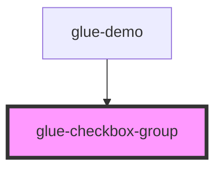

# glue-checkbox-group

<!-- Auto Generated Below -->

## Properties

| Property       | Attribute       | Description | Type               | Default     |
| -------------- | --------------- | ----------- | ------------------ | ----------- |
| `checkedColor` | `checked-color` |             | `string`           | `undefined` |
| `direction`    | `direction`     |             | `string`           | `undefined` |
| `disabled`     | `disabled`      |             | `string`           | `undefined` |
| `first`        | `first`         |             | `string`           | `undefined` |
| `iconSize`     | `icon-size`     |             | `number \| string` | `undefined` |
| `max`          | `max`           |             | `number \| string` | `undefined` |
| `model_value`  | `model_value`   |             | `any`              | `undefined` |

## Dependencies

### Used by

- [glue-demo](../glue-demo)

### Graph

---

_Built with [StencilJS](https://stenciljs.com/)_
