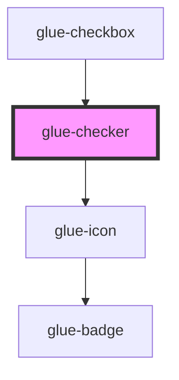

# glue-checker

<!-- Auto Generated Below -->

## Properties

| Property        | Attribute        | Description | Type               | Default     |
| --------------- | ---------------- | ----------- | ------------------ | ----------- |
| `bem`           | `bem`            |             | `string`           | `'true'`    |
| `bindGroup`     | `bind-group`     |             | `string`           | `'true'`    |
| `checked`       | `checked`        |             | `string`           | `undefined` |
| `checkedColor`  | `checked-color`  |             | `string`           | `undefined` |
| `disabled`      | `disabled`       |             | `string`           | `undefined` |
| `icon`          | `icon`           |             | `string`           | `''`        |
| `iconSize`      | `icon-size`      |             | `number \| string` | `undefined` |
| `label`         | `label`          |             | `string`           | `undefined` |
| `labelDisabled` | `label-disabled` |             | `string`           | `undefined` |
| `labelPosition` | `label-position` |             | `string`           | `undefined` |
| `modelValue`    | `model-value`    |             | `any`              | `undefined` |
| `name`          | `name`           |             | `number \| string` | `undefined` |
| `parent`        | `parent`         |             | `any`              | `undefined` |
| `role`          | `role`           |             | `string`           | `undefined` |
| `shape`         | `shape`          |             | `string`           | `'round'`   |

## Events

| Event        | Description | Type               |
| ------------ | ----------- | ------------------ |
| `glueCilck`  |             | `CustomEvent<any>` |
| `glueToggle` |             | `CustomEvent<any>` |

## Dependencies

### Used by

 - [glue-checkbox](../glue-checkbox)

### Depends on

- [glue-icon](../glue-icon)

### Graph

----------------------------------------------

*Built with [StencilJS](https://stenciljs.com/)*
