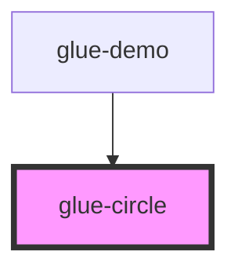

# glue-circle

<!-- Auto Generated Below -->

## Properties

| Property        | Attribute        | Description | Type               | Default     |
| --------------- | ---------------- | ----------- | ------------------ | ----------- |
| `clockwise`     | `clockwise`      |             | `boolean`          | `true`      |
| `currentRate`   | `current-rate`   |             | `number`           | `0`         |
| `fill`          | `fill`           |             | `string`           | `'none'`    |
| `layerColor`    | `layer-color`    |             | `string`           | `undefined` |
| `lineColor`     | `line-color`     |             | `object \| string` | `undefined` |
| `rate`          | `rate`           |             | `number`           | `100`       |
| `size`          | `size`           |             | `string`           | `undefined` |
| `speed`         | `speed`          |             | `number`           | `0`         |
| `strokeLinecap` | `stroke-linecap` |             | `string`           | `undefined` |
| `strokeWidth`   | `stroke-width`   |             | `number`           | `40`        |
| `text`          | `text`           |             | `string`           | `undefined` |

## Events

| Event        | Description | Type               |
| ------------ | ----------- | ------------------ |
| `glueChange` |             | `CustomEvent<any>` |

## Dependencies

### Used by

 - [glue-demo](../glue-demo)

### Graph

----------------------------------------------

*Built with [StencilJS](https://stenciljs.com/)*
