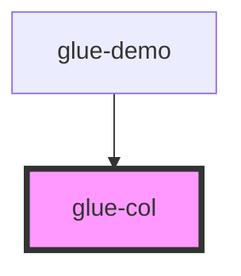

# glue-col

<!-- Auto Generated Below -->

## Properties

| Property | Attribute | Description | Type               | Default |
| -------- | --------- | ----------- | ------------------ | ------- |
| `offset` | `offset`  |             | `number \| string` | `0`     |
| `span`   | `span`    |             | `number \| string` | `0`     |

## Dependencies

### Used by

 - [glue-demo](../glue-demo)

### Graph

----------------------------------------------

*Built with [StencilJS](https://stenciljs.com/)*
