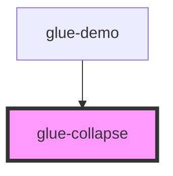

# glue-collapse

<!-- Auto Generated Below -->

## Properties

| Property     | Attribute   | Description | Type      | Default     |
| ------------ | ----------- | ----------- | --------- | ----------- |
| `accordion`  | `accordion` |             | `boolean` | `undefined` |
| `border`     | `border`    |             | `boolean` | `false`     |
| `modelValue` | --          |             | `any[]`   | `[]`        |

## Events

| Event        | Description | Type               |
| ------------ | ----------- | ------------------ |
| `glueToggle` |             | `CustomEvent<any>` |

## Methods

### `isExpanded(name: any) => Promise<boolean>`

#### Returns

Type: `Promise<boolean>`

### `toggle(name: any, expanded: any) => Promise<void>`

#### Returns

Type: `Promise<void>`

## Dependencies

### Used by

 - [glue-demo](../glue-demo)

### Graph

----------------------------------------------

*Built with [StencilJS](https://stenciljs.com/)*
