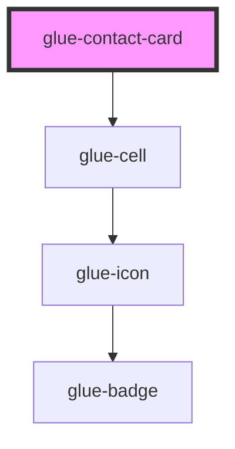

# glue-contact-card

<!-- Auto Generated Below -->

## Properties

| Property   | Attribute  | Description | Type      | Default     |
| ---------- | ---------- | ----------- | --------- | ----------- |
| `addText`  | `add-text` |             | `string`  | `undefined` |
| `editable` | `editable` |             | `boolean` | `true`      |
| `name`     | `name`     |             | `string`  | `undefined` |
| `tel`      | `tel`      |             | `string`  | `undefined` |
| `type`     | `type`     |             | `string`  | `'add'`     |

## Dependencies

### Depends on

- [glue-cell](../glue-cell)

### Graph

----------------------------------------------

*Built with [StencilJS](https://stenciljs.com/)*
