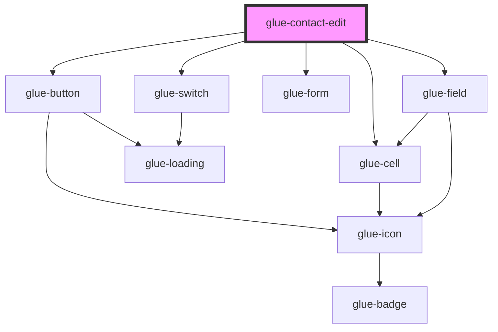

# glue-contact-edit

<!-- Auto Generated Below -->

## Properties

| Property          | Attribute           | Description | Type                             | Default                  |
| ----------------- | ------------------- | ----------- | -------------------------------- | ------------------------ |
| `contactInfo`     | --                  |             | `{ tel: string; name: string; }` | `{ ...DEFAULT_CONTACT }` |
| `isDeleting`      | `is-deleting`       |             | `boolean`                        | `undefined`              |
| `isEdit`          | `is-edit`           |             | `boolean`                        | `undefined`              |
| `isSaving`        | `is-saving`         |             | `boolean`                        | `undefined`              |
| `setDefaultLabel` | `set-default-label` |             | `string`                         | `undefined`              |
| `showSetDefault`  | `show-set-default`  |             | `boolean`                        | `undefined`              |
| `telValidator`    | --                  |             | `(value: string) => boolean`     | `isMobile`               |

## Dependencies

### Depends on

- [glue-button](../glue-button)
- [glue-switch](../glue-switch)
- [glue-cell](../glue-cell)
- [glue-form](../glue-form)
- [glue-field](../glue-field)

### Graph

----------------------------------------------

*Built with [StencilJS](https://stenciljs.com/)*
