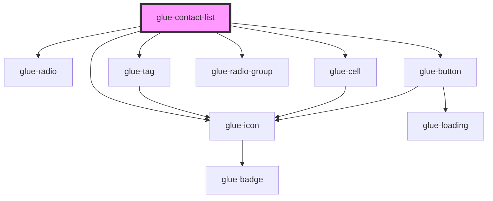

# glue-contact-list

<!-- Auto Generated Below -->

## Properties

| Property         | Attribute          | Description | Type     | Default     |
| ---------------- | ------------------ | ----------- | -------- | ----------- |
| `addText`        | `add-text`         |             | `string` | `undefined` |
| `defaultTagText` | `default-tag-text` |             | `string` | `undefined` |
| `list`           | `list`             |             | `any`    | `undefined` |
| `modelValue`     | `model-value`      |             | `any`    | `null`      |

## Dependencies

### Depends on

- [glue-radio](../glue-radio)
- [glue-icon](../glue-icon)
- [glue-tag](../glue-tag)
- [glue-cell](../glue-cell)
- [glue-radio-group](../glue-radio-group)
- [glue-button](../glue-button)

### Graph

---

_Built with [StencilJS](https://stenciljs.com/)_
