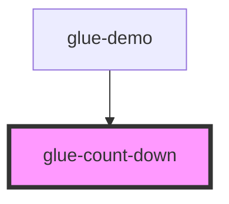

# glue-count-down

<!-- Auto Generated Below -->

## Properties

| Property      | Attribute     | Description | Type      | Default      |
| ------------- | ------------- | ----------- | --------- | ------------ |
| `autoStart`   | `auto-start`  |             | `boolean` | `false`      |
| `custom`      | `custom`      |             | `boolean` | `undefined`  |
| `format`      | `format`      |             | `string`  | `'HH:mm:ss'` |
| `millisecond` | `millisecond` |             | `boolean` | `undefined`  |
| `time`        | `time`        |             | `number`  | `0`          |

## Events

| Event        | Description | Type               |
| ------------ | ----------- | ------------------ |
| `glueChange` |             | `CustomEvent<any>` |
| `glueFinish` |             | `CustomEvent<any>` |

## Methods

### `pause() => Promise<void>`

#### Returns

Type: `Promise<void>`

### `reset() => Promise<void>`

#### Returns

Type: `Promise<void>`

### `start() => Promise<void>`

#### Returns

Type: `Promise<void>`

## Dependencies

### Used by

 - [glue-demo](../glue-demo)

### Graph

----------------------------------------------

*Built with [StencilJS](https://stenciljs.com/)*
