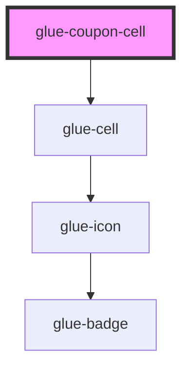

# glue-coupon-cell

<!-- Auto Generated Below -->

## Properties

| Property       | Attribute       | Description | Type      | Default     |
| -------------- | --------------- | ----------- | --------- | ----------- |
| `border`       | `border`        |             | `boolean` | `true`      |
| `chosenCoupon` | `chosen-coupon` |             | `number`  | `-1`        |
| `coupons`      | --              |             | `[]`      | `undefined` |
| `currency`     | `currency`      |             | `string`  | `'¥'`       |
| `editable`     | `editable`      |             | `boolean` | `true`      |
| `g_title`      | `g_title`       |             | `string`  | `undefined` |

## Dependencies

### Depends on

- [glue-cell](../glue-cell)

### Graph

----------------------------------------------

*Built with [StencilJS](https://stenciljs.com/)*
