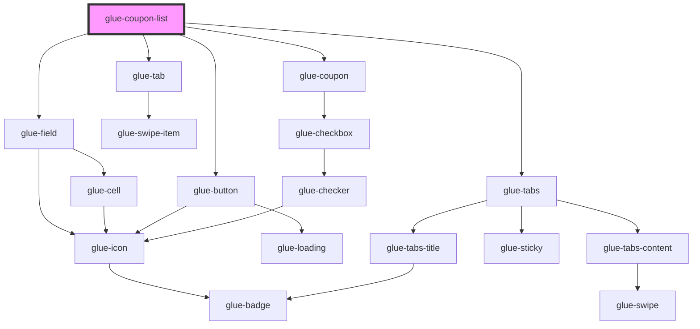

# glue-coupon-list

<!-- Auto Generated Below -->

## Properties

| Property                 | Attribute                  | Description | Type      | Default       |
| ------------------------ | -------------------------- | ----------- | --------- | ------------- |
| `chosenCoupon`           | `chosen-coupon`            |             | `number`  | `-1`          |
| `closeButtonText`        | `close-button-text`        |             | `string`  | `undefined`   |
| `code`                   | `code`                     |             | `string`  | `undefined`   |
| `coupons`                | --                         |             | `any[]`   | `[]`          |
| `currency`               | `currency`                 |             | `string`  | `'¥'`         |
| `disabledCoupons`        | --                         |             | `any[]`   | `[]`          |
| `disabledTitle`          | `disabled-title`           |             | `string`  | `undefined`   |
| `displayedCouponIndex`   | `displayed-coupon-index`   |             | `number`  | `-1`          |
| `emptyImage`             | `empty-image`              |             | `string`  | `EMPTY_IMAGE` |
| `enabledTitle`           | `enabled-title`            |             | `string`  | `undefined`   |
| `exchangeButtonDisabled` | `exchange-button-disabled` |             | `boolean` | `undefined`   |
| `exchangeButtonLoading`  | `exchange-button-loading`  |             | `boolean` | `undefined`   |
| `exchangeButtonText`     | `exchange-button-text`     |             | `string`  | `undefined`   |
| `exchangeMinLength`      | `exchange-min-length`      |             | `number`  | `1`           |
| `first`                  | `first`                    |             | `string`  | `undefined`   |
| `inputPlaceholder`       | `input-placeholder`        |             | `string`  | `undefined`   |
| `showCloseButton`        | `show-close-button`        |             | `boolean` | `true`        |
| `showCount`              | `show-count`               |             | `boolean` | `true`        |
| `showExchangeBar`        | `show-exchange-bar`        |             | `boolean` | `true`        |

## Dependencies

### Depends on

- [glue-field](../glue-field)
- [glue-button](../glue-button)
- [glue-tab](../glue-tab)
- [glue-coupon](../glue-coupon)
- [glue-tabs](../glue-tabs)

### Graph

----------------------------------------------

*Built with [StencilJS](https://stenciljs.com/)*
