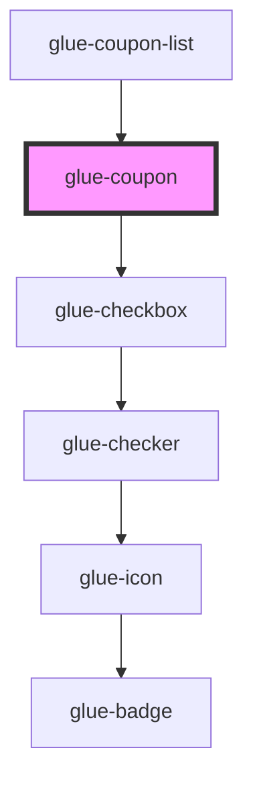

# glue-coupon

<!-- Auto Generated Below -->

## Properties

| Property   | Attribute  | Description | Type      | Default     |
| ---------- | ---------- | ----------- | --------- | ----------- |
| `chosen`   | `chosen`   |             | `boolean` | `undefined` |
| `coupon`   | `coupon`   |             | `any`     | `undefined` |
| `currency` | `currency` |             | `string`  | `'¥'`       |
| `disabled` | `disabled` |             | `boolean` | `undefined` |

## Dependencies

### Used by

- [glue-coupon-list](../glue-coupon-list)

### Depends on

- [glue-checkbox](../glue-checkbox)

### Graph

---

_Built with [StencilJS](https://stenciljs.com/)_
