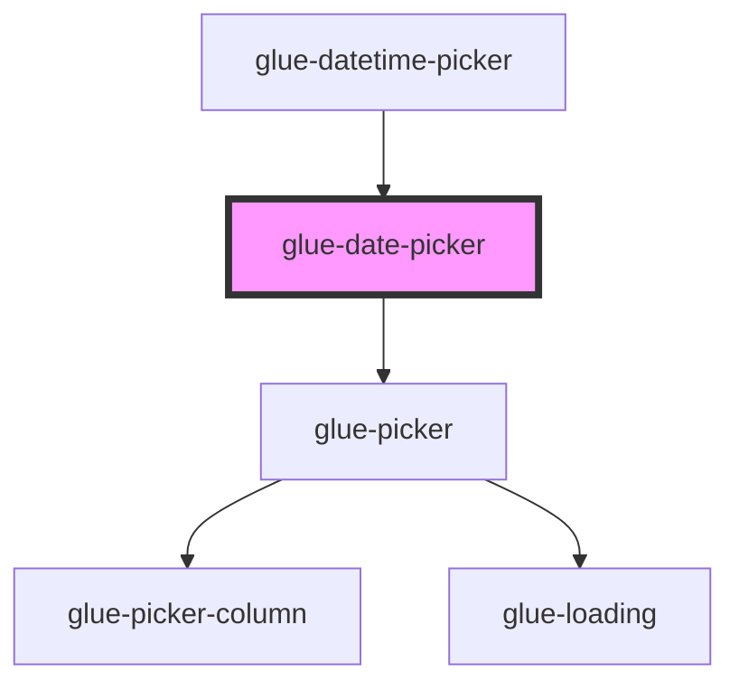

# glue-date-picker

<!-- Auto Generated Below -->

## Properties

| Property            | Attribute             | Description | Type       | Default                                    |
| ------------------- | --------------------- | ----------- | ---------- | ------------------------------------------ |
| `allowHtml`         | `allow-html`          |             | `boolean`  | `undefined`                                |
| `cancelButtonText`  | `cancel-button-text`  |             | `string`   | `undefined`                                |
| `columnsOrder`      | --                    |             | `[]`       | `undefined`                                |
| `confirmButtonText` | `confirm-button-text` |             | `string`   | `undefined`                                |
| `filter`            | `filter`              |             | `any`      | `undefined`                                |
| `formatter`         | --                    |             | `Function` | `(_type: string, value: unknown) => value` |
| `itemHeight`        | `item-height`         |             | `number`   | `44`                                       |
| `loading`           | `loading`             |             | `boolean`  | `undefined`                                |
| `maxDate`           | --                    |             | `Date`     | `new Date(currentYear + 10, 11, 31)`       |
| `minDate`           | --                    |             | `Date`     | `new Date(currentYear - 10, 0, 1)`         |
| `modelValue`        | `model-value`         |             | `any`      | `null`                                     |
| `readonly`          | `readonly`            |             | `boolean`  | `undefined`                                |
| `showToolbar`       | `show-toolbar`        |             | `boolean`  | `true`                                     |
| `swipeDuration`     | `swipe-duration`      |             | `number`   | `1000`                                     |
| `title`             | `title`               |             | `string`   | `undefined`                                |
| `type`              | `type`                |             | `string`   | `'datetime'`                               |
| `visibleItemCount`  | `visible-item-count`  |             | `number`   | `6`                                        |

## Dependencies

### Used by

 - [glue-datetime-picker](../glue-datetime-picker)

### Depends on

- [glue-picker](../glue-picker)

### Graph

----------------------------------------------

*Built with [StencilJS](https://stenciljs.com/)*
