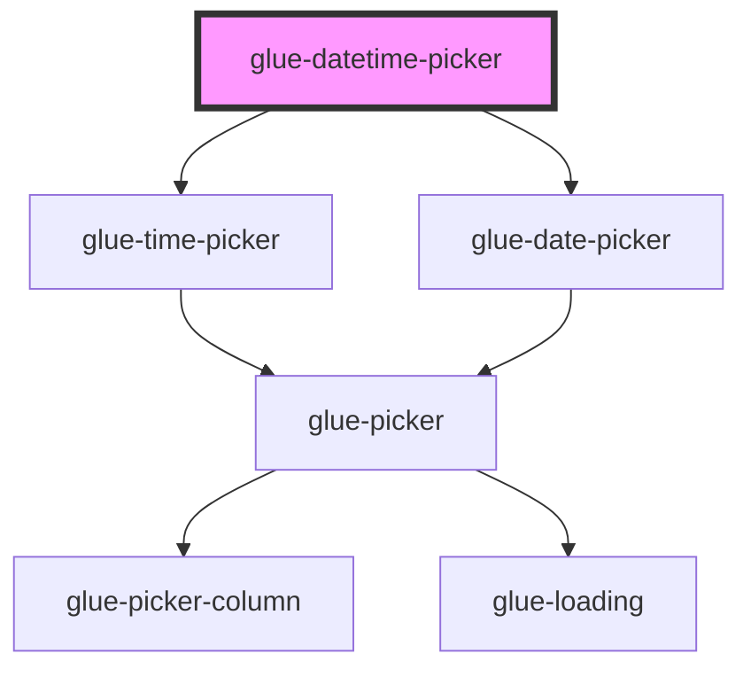

# glue-datetime-picker

<!-- Auto Generated Below -->

## Properties

| Property            | Attribute             | Description | Type               | Default                              |
| ------------------- | --------------------- | ----------- | ------------------ | ------------------------------------ |
| `allowHtml`         | `allow-html`          |             | `boolean`          | `undefined`                          |
| `cancelButtonText`  | `cancel-button-text`  |             | `string`           | `undefined`                          |
| `columnsOrder`      | --                    |             | `[]`               | `undefined`                          |
| `confirmButtonText` | `confirm-button-text` |             | `string`           | `undefined`                          |
| `filter`            | `filter`              |             | `any`              | `undefined`                          |
| `fimaxMinuterst`    | `fimax-minuterst`     |             | `number \| string` | `59`                                 |
| `formatter`         | `formatter`           |             | `any`              | `undefined`                          |
| `g_title`           | `g_title`             |             | `string`           | `undefined`                          |
| `itemHeight`        | `item-height`         |             | `number`           | `44`                                 |
| `loading`           | `loading`             |             | `boolean`          | `undefined`                          |
| `maxDate`           | --                    |             | `Date`             | `new Date(currentYear + 10, 11, 31)` |
| `maxHour`           | `max-hour`            |             | `number`           | `23`                                 |
| `minDate`           | --                    |             | `Date`             | `new Date(currentYear - 10, 0, 1)`   |
| `minHour`           | `min-hour`            |             | `number`           | `0`                                  |
| `minMinute`         | `min-minute`          |             | `number`           | `0`                                  |
| `modelValue`        | `model-value`         |             | `any`              | `null`                               |
| `readonly`          | `readonly`            |             | `boolean`          | `undefined`                          |
| `showToolbar`       | `show-toolbar`        |             | `boolean`          | `false`                              |
| `swipeDuration`     | `swipe-duration`      |             | `number`           | `1000`                               |
| `type`              | `type`                |             | `string`           | `'datetime'`                         |
| `visibleItemCount`  | `visible-item-count`  |             | `number`           | `6`                                  |

## Dependencies

### Depends on

- [glue-time-picker](../glue-time-picker)
- [glue-date-picker](../glue-date-picker)

### Graph

----------------------------------------------

*Built with [StencilJS](https://stenciljs.com/)*
