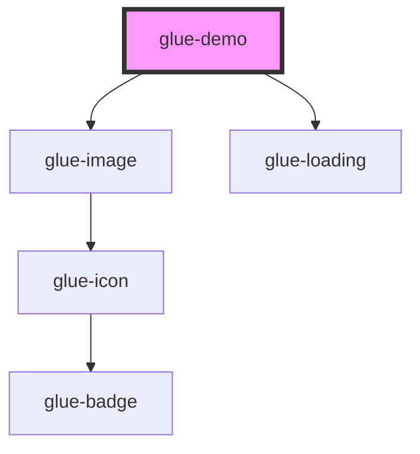

# glue-demo

<!-- Auto Generated Below -->

## Properties

| Property | Attribute | Description | Type     | Default     |
| -------- | --------- | ----------- | -------- | ----------- |
| `first`  | `first`   |             | `string` | `undefined` |

## Dependencies

### Depends on

- [glue-image](../glue-image)
- [glue-loading](../glue-loading)

### Graph

----------------------------------------------

*Built with [StencilJS](https://stenciljs.com/)*
