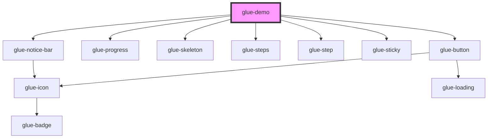

# glue-demo

<!-- Auto Generated Below -->

## Properties

| Property | Attribute | Description | Type     | Default     |
| -------- | --------- | ----------- | -------- | ----------- |
| `first`  | `first`   |             | `string` | `undefined` |
| `last`   | `last`    |             | `string` | `undefined` |
| `middle` | `middle`  |             | `string` | `undefined` |

## Dependencies

### Depends on

- [glue-notice-bar](../glue-notice-bar)
- [glue-progress](../glue-progress)
- [glue-skeleton](../glue-skeleton)
- [glue-steps](../glue-steps)
- [glue-step](../glue-step)
- [glue-sticky](../glue-sticky)
- [glue-button](../glue-button)

### Graph

----------------------------------------------

*Built with [StencilJS](https://stenciljs.com/)*
