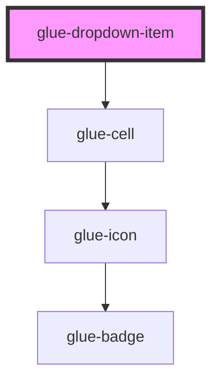

# glue-dropdown-item

<!-- Auto Generated Below -->

## Properties

| Property     | Attribute     | Description | Type      | Default     |
| ------------ | ------------- | ----------- | --------- | ----------- |
| `disabled`   | `disabled`    |             | `boolean` | `undefined` |
| `first`      | `first`       |             | `string`  | `undefined` |
| `lazyRender` | `lazy-render` |             | `boolean` | `true`      |
| `modelValue` | `model-value` |             | `any`     | `null`      |
| `options`    | --            |             | `any[]`   | `[]`        |
| `teleport`   | `teleport`    |             | `any`     | `undefined` |
| `title`      | `title`       |             | `string`  | `undefined` |
| `titleClass` | `title-class` |             | `any`     | `null`      |

## Dependencies

### Depends on

- [glue-cell](../glue-cell)

### Graph

---

_Built with [StencilJS](https://stenciljs.com/)_
