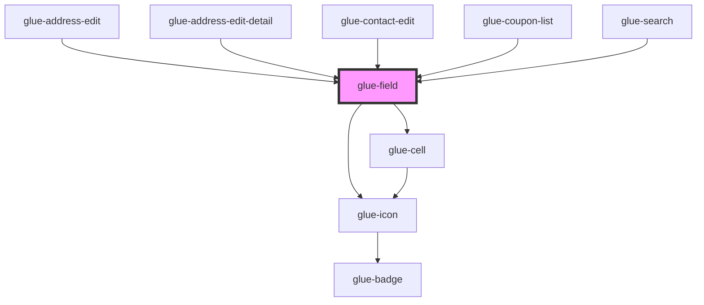

# glue-field

<!-- Auto Generated Below -->

## Properties

| Property            | Attribute             | Description | Type                                  | Default      |
| ------------------- | --------------------- | ----------- | ------------------------------------- | ------------ |
| `arrowDirection`    | `arrow-direction`     |             | `"down" \| "left" \| "right" \| "up"` | `undefined`  |
| `autocomplete`      | `autocomplete`        |             | `string`                              | `undefined`  |
| `autosize`          | `autosize`            |             | `any`                                 | `undefined`  |
| `border`            | `border`              |             | `boolean`                             | `true`       |
| `button`            | `button`              |             | `string`                              | `undefined`  |
| `center`            | `center`              |             | `boolean`                             | `undefined`  |
| `clearTrigger`      | `clear-trigger`       |             | `string`                              | `'focus'`    |
| `clearable`         | `clearable`           |             | `boolean`                             | `undefined`  |
| `clickable`         | `clickable`           |             | `boolean`                             | `undefined`  |
| `colon`             | `colon`               |             | `any`                                 | `null`       |
| `disabled`          | `disabled`            |             | `any`                                 | `null`       |
| `error`             | `error`               |             | `any`                                 | `null`       |
| `errorMessage`      | `error-message`       |             | `string`                              | `undefined`  |
| `errorMessageAlign` | `error-message-align` |             | `string`                              | `undefined`  |
| `formatTrigger`     | `format-trigger`      |             | `string`                              | `'onChange'` |
| `formatter`         | `formatter`           |             | `any`                                 | `undefined`  |
| `g_title`           | `g_title`             |             | `string`                              | `undefined`  |
| `icon`              | `icon`                |             | `string`                              | `undefined`  |
| `iconPrefix`        | `icon-prefix`         |             | `string`                              | `undefined`  |
| `inputAlign`        | `input-align`         |             | `string`                              | `undefined`  |
| `isLink`            | `is-link`             |             | `boolean`                             | `undefined`  |
| `label`             | `label`               |             | `number \| string`                    | `undefined`  |
| `labelAlign`        | `label-align`         |             | `string`                              | `undefined`  |
| `labelClass`        | `label-class`         |             | `any`                                 | `null`       |
| `labelWidth`        | `label-width`         |             | `number \| string`                    | `undefined`  |
| `leftIcon`          | `left-icon`           |             | `string`                              | `undefined`  |
| `maxlength`         | `maxlength`           |             | `number \| string`                    | `50`         |
| `modelValue`        | `model-value`         |             | `string`                              | `undefined`  |
| `name`              | `name`                |             | `string`                              | `undefined`  |
| `placeholder`       | `placeholder`         |             | `string`                              | `undefined`  |
| `readonly`          | `readonly`            |             | `any`                                 | `null`       |
| `required`          | `required`            |             | `boolean`                             | `undefined`  |
| `rightIcon`         | `right-icon`          |             | `string`                              | `undefined`  |
| `rows`              | `rows`                |             | `number`                              | `undefined`  |
| `rules`             | `rules`               |             | `any`                                 | `undefined`  |
| `showWordLimit`     | `show-word-limit`     |             | `boolean`                             | `undefined`  |
| `size`              | `size`                |             | `string`                              | `undefined`  |
| `tilabelClasstle`   | `tilabel-classtle`    |             | `any`                                 | `null`       |
| `titleClass`        | `title-class`         |             | `any`                                 | `null`       |
| `titleStyle`        | `title-style`         |             | `any`                                 | `null`       |
| `type`              | `type`                |             | `string`                              | `'text'`     |
| `value`             | `value`               |             | `number \| string`                    | `undefined`  |
| `valueClass`        | `value-class`         |             | `any`                                 | `null`       |

## Dependencies

### Used by

- [glue-address-edit](../glue-address-edit)
- [glue-address-edit-detail](../glue-address-edit-detail)
- [glue-contact-edit](../glue-contact-edit)
- [glue-coupon-list](../glue-coupon-list)
- [glue-search](../glue-search)

### Depends on

- [glue-icon](../glue-icon)
- [glue-cell](../glue-cell)

### Graph

---

_Built with [StencilJS](https://stenciljs.com/)_
