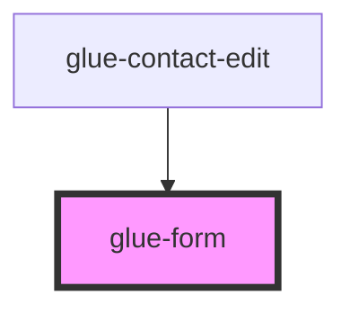

# glue-form

<!-- Auto Generated Below -->

## Properties

| Property            | Attribute             | Description | Type               | Default     |
| ------------------- | --------------------- | ----------- | ------------------ | ----------- |
| `colon`             | `colon`               |             | `boolean`          | `undefined` |
| `disabled`          | `disabled`            |             | `boolean`          | `undefined` |
| `errorMessageAlign` | `error-message-align` |             | `string`           | `undefined` |
| `inputAlign`        | `input-align`         |             | `string`           | `undefined` |
| `labelAlign`        | `label-align`         |             | `string`           | `undefined` |
| `labelWidth`        | `label-width`         |             | `number \| string` | `undefined` |
| `readonly`          | `readonly`            |             | `boolean`          | `undefined` |
| `scrollToError`     | `scroll-to-error`     |             | `boolean`          | `undefined` |
| `showError`         | `show-error`          |             | `boolean`          | `undefined` |
| `showErrorMessage`  | `show-error-message`  |             | `boolean`          | `true`      |
| `submitOnEnter`     | `submit-on-enter`     |             | `boolean`          | `true`      |
| `validateFirst`     | `validate-first`      |             | `boolean`          | `undefined` |
| `validateTrigger`   | `validate-trigger`    |             | `string`           | `'onBlur'`  |

## Events

| Event          | Description | Type               |
| -------------- | ----------- | ------------------ |
| `failed`       |             | `CustomEvent<any>` |
| `submitChange` |             | `CustomEvent<any>` |

## Dependencies

### Used by

- [glue-contact-edit](../glue-contact-edit)

### Graph

---

_Built with [StencilJS](https://stenciljs.com/)_
