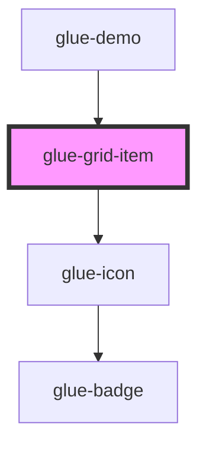

# glue-grid-item

<!-- Auto Generated Below -->

## Properties

| Property     | Attribute     | Description | Type               | Default     |
| ------------ | ------------- | ----------- | ------------------ | ----------- |
| `badge`      | `badge`       |             | `number \| string` | `undefined` |
| `clickable`  | `clickable`   |             | `boolean`          | `undefined` |
| `custom`     | `custom`      |             | `string`           | `undefined` |
| `dot`        | `dot`         |             | `boolean`          | `undefined` |
| `icon`       | `icon`        |             | `string`           | `undefined` |
| `iconPrefix` | `icon-prefix` |             | `string`           | `undefined` |
| `text`       | `text`        |             | `string`           | `undefined` |

## Dependencies

### Used by

 - [glue-demo](../glue-demo)

### Depends on

- [glue-icon](../glue-icon)

### Graph

----------------------------------------------

*Built with [StencilJS](https://stenciljs.com/)*
