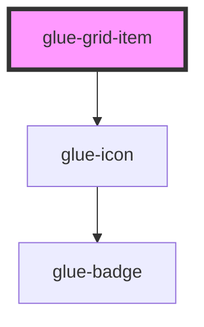

# glue-grid-item

<!-- Auto Generated Below -->

## Properties

| Property     | Attribute     | Description | Type                         | Default     |
| ------------ | ------------- | ----------- | ---------------------------- | ----------- |
| `badge`      | `badge`       |             | `number \| string`           | `undefined` |
| `border`     | `border`      |             | `boolean`                    | `undefined` |
| `center`     | `center`      |             | `boolean`                    | `undefined` |
| `clickable`  | `clickable`   |             | `boolean`                    | `undefined` |
| `columnNum`  | `column-num`  |             | `number \| string`           | `undefined` |
| `direction`  | `direction`   |             | `"horizontal" \| "vertical"` | `undefined` |
| `dot`        | `dot`         |             | `boolean`                    | `undefined` |
| `gutter`     | `gutter`      |             | `number \| string`           | `undefined` |
| `icon`       | `icon`        |             | `string`                     | `undefined` |
| `iconPrefix` | `icon-prefix` |             | `string`                     | `undefined` |
| `iconSize`   | `icon-size`   |             | `number`                     | `undefined` |
| `square`     | `square`      |             | `boolean`                    | `undefined` |
| `text`       | `text`        |             | `string`                     | `undefined` |

## Dependencies

### Depends on

- [glue-icon](../glue-icon)

### Graph

----------------------------------------------

*Built with [StencilJS](https://stenciljs.com/)*
