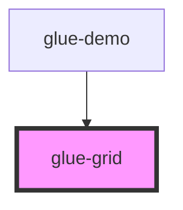

# glue-grid

<!-- Auto Generated Below -->

## Properties

| Property    | Attribute    | Description | Type                         | Default     |
| ----------- | ------------ | ----------- | ---------------------------- | ----------- |
| `border`    | `border`     |             | `boolean`                    | `undefined` |
| `center`    | `center`     |             | `boolean`                    | `undefined` |
| `clickable` | `clickable`  |             | `boolean`                    | `undefined` |
| `columnNum` | `column-num` |             | `number \| string`           | `4`         |
| `direction` | `direction`  |             | `"horizontal" \| "vertical"` | `undefined` |
| `gutter`    | `gutter`     |             | `number \| string`           | `undefined` |
| `iconSize`  | `icon-size`  |             | `number \| string`           | `28`        |
| `square`    | `square`     |             | `boolean`                    | `undefined` |

## Dependencies

### Used by

 - [glue-demo](../glue-demo)

### Graph

----------------------------------------------

*Built with [StencilJS](https://stenciljs.com/)*
