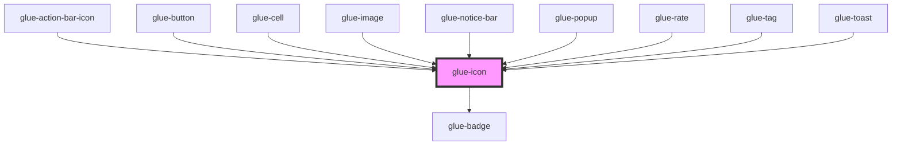

# glue-icon

<!-- Auto Generated Below -->

## Properties

| Property      | Attribute      | Description | Type               | Default     |
| ------------- | -------------- | ----------- | ------------------ | ----------- |
| `badge`       | `badge`        |             | `number \| string` | `undefined` |
| `classPrefix` | `class-prefix` |             | `string`           | `undefined` |
| `color`       | `color`        |             | `string`           | `undefined` |
| `dot`         | `dot`          |             | `boolean`          | `undefined` |
| `name`        | `name`         |             | `string`           | `undefined` |
| `size`        | `size`         |             | `number`           | `22`        |
| `tag`         | `tag`          |             | `string`           | `undefined` |

## Dependencies

### Used by

 - [glue-action-bar-icon](../glue-action-bar-icon)
 - [glue-button](../glue-button)
 - [glue-cell](../glue-cell)
 - [glue-image](../glue-image)
 - [glue-notice-bar](../glue-notice-bar)
 - [glue-popup](../glue-popup)
 - [glue-rate](../glue-rate)
 - [glue-tag](../glue-tag)
 - [glue-toast](../glue-toast)

### Depends on

- [glue-badge](../glue-badge)

### Graph

----------------------------------------------

*Built with [StencilJS](https://stenciljs.com/)*
