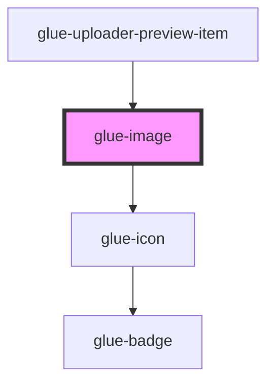

# glue-image

<!-- Auto Generated Below -->

## Properties

| Property      | Attribute      | Description | Type                                                       | Default        |
| ------------- | -------------- | ----------- | ---------------------------------------------------------- | -------------- |
| `alt`         | `alt`          |             | `string`                                                   | `undefined`    |
| `errorIcon`   | `error-icon`   |             | `string`                                                   | `'photo-fail'` |
| `fit`         | `fit`          |             | `"contain" \| "cover" \| "fill" \| "none" \| "scale-down"` | `undefined`    |
| `height`      | `height`       |             | `number \| string`                                         | `undefined`    |
| `iconPrefix`  | `icon-prefix`  |             | `string`                                                   | `undefined`    |
| `lazyLoad`    | `lazy-load`    |             | `boolean`                                                  | `undefined`    |
| `loadingIcon` | `loading-icon` |             | `string`                                                   | `'photo'`      |
| `radius`      | `radius`       |             | `number \| string`                                         | `undefined`    |
| `round`       | `round`        |             | `boolean`                                                  | `undefined`    |
| `showError`   | `show-error`   |             | `boolean`                                                  | `true`         |
| `showLoading` | `show-loading` |             | `boolean`                                                  | `true`         |
| `src`         | `src`          |             | `string`                                                   | `undefined`    |
| `width`       | `width`        |             | `number \| string`                                         | `undefined`    |

## Events

| Event       | Description | Type               |
| ----------- | ----------- | ------------------ |
| `glueError` |             | `CustomEvent<any>` |
| `glueLoad`  |             | `CustomEvent<any>` |

## Dependencies

### Used by

 - [glue-uploader-preview-item](../glue-uploader-preview-item)

### Depends on

- [glue-icon](../glue-icon)

### Graph

----------------------------------------------

*Built with [StencilJS](https://stenciljs.com/)*
