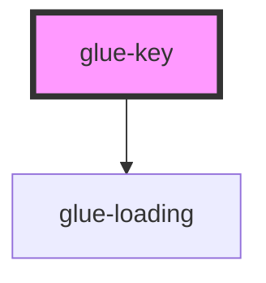

# glue-key

<!-- Auto Generated Below -->

## Properties

| Property  | Attribute | Description | Type               | Default     |
| --------- | --------- | ----------- | ------------------ | ----------- |
| `color`   | `color`   |             | `string`           | `undefined` |
| `large`   | `large`   |             | `boolean`          | `undefined` |
| `loading` | `loading` |             | `boolean`          | `undefined` |
| `text`    | `text`    |             | `number \| string` | `undefined` |
| `type`    | `type`    |             | `string`           | `undefined` |
| `wider`   | `wider`   |             | `boolean`          | `undefined` |

## Dependencies

### Depends on

- [glue-loading](../glue-loading)

### Graph

----------------------------------------------

*Built with [StencilJS](https://stenciljs.com/)*
