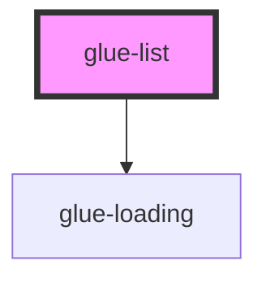

# glue-list

<!-- Auto Generated Below -->

## Properties

| Property         | Attribute         | Description | Type      | Default     |
| ---------------- | ----------------- | ----------- | --------- | ----------- |
| `direction`      | `direction`       |             | `string`  | `'down'`    |
| `error`          | `error`           |             | `boolean` | `undefined` |
| `errorText`      | `error-text`      |             | `string`  | `undefined` |
| `finished`       | `finished`        |             | `boolean` | `undefined` |
| `finishedText`   | `finished-text`   |             | `string`  | `undefined` |
| `immediateCheck` | `immediate-check` |             | `boolean` | `true`      |
| `loading`        | `loading`         |             | `boolean` | `undefined` |
| `loadingText`    | `loading-text`    |             | `string`  | `undefined` |
| `offset`         | `offset`          |             | `number`  | `300`       |

## Events

| Event            | Description | Type               |
| ---------------- | ----------- | ------------------ |
| `clickErrorText` |             | `CustomEvent<any>` |

## Dependencies

### Depends on

- [glue-loading](../glue-loading)

### Graph

----------------------------------------------

*Built with [StencilJS](https://stenciljs.com/)*
