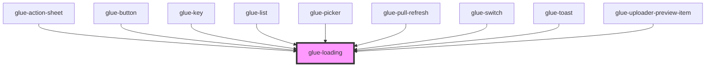

# glue-loading

<!-- Auto Generated Below -->

## Properties

| Property    | Attribute    | Description | Type               | Default      |
| ----------- | ------------ | ----------- | ------------------ | ------------ |
| `color`     | `color`      |             | `string`           | `undefined`  |
| `size`      | `size`       |             | `number \| string` | `undefined`  |
| `text`      | `text`       |             | `string`           | `undefined`  |
| `textColor` | `text-color` |             | `string`           | `undefined`  |
| `textSize`  | `text-size`  |             | `number \| string` | `undefined`  |
| `type`      | `type`       |             | `string`           | `'circular'` |
| `vertical`  | `vertical`   |             | `boolean`          | `undefined`  |

## Dependencies

### Used by

 - [glue-action-sheet](../glue-action-sheet)
 - [glue-button](../glue-button)
 - [glue-key](../glue-key)
 - [glue-list](../glue-list)
 - [glue-picker](../glue-picker)
 - [glue-pull-refresh](../glue-pull-refresh)
 - [glue-switch](../glue-switch)
 - [glue-toast](../glue-toast)
 - [glue-uploader-preview-item](../glue-uploader-preview-item)

### Graph

----------------------------------------------

*Built with [StencilJS](https://stenciljs.com/)*
