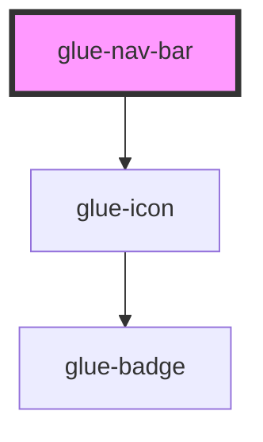

# glue-nav-bar

<!-- Auto Generated Below -->

## Properties

| Property           | Attribute             | Description | Type               | Default     |
| ------------------ | --------------------- | ----------- | ------------------ | ----------- |
| `border`           | `border`              |             | `boolean`          | `true`      |
| `fixed`            | `fixed`               |             | `boolean`          | `undefined` |
| `leftArrow`        | `left-arrow`          |             | `boolean`          | `undefined` |
| `leftText`         | `left-text`           |             | `string`           | `undefined` |
| `placeholder`      | `placeholder`         |             | `boolean`          | `undefined` |
| `rightText`        | `right-text`          |             | `string`           | `undefined` |
| `safeAreaInsetTop` | `safe-area-inset-top` |             | `boolean`          | `undefined` |
| `title`            | `title`               |             | `string`           | `undefined` |
| `zIndex`           | `z-index`             |             | `number \| string` | `undefined` |

## Events

| Event        | Description | Type               |
| ------------ | ----------- | ------------------ |
| `clickLeft`  |             | `CustomEvent<any>` |
| `clickRight` |             | `CustomEvent<any>` |

## Dependencies

### Depends on

- [glue-icon](../glue-icon)

### Graph

----------------------------------------------

*Built with [StencilJS](https://stenciljs.com/)*
