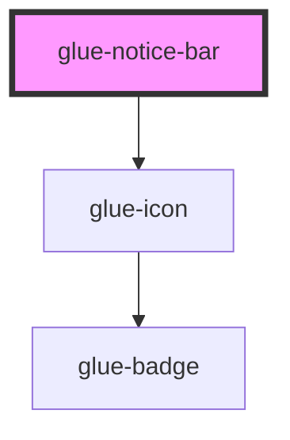

# glue-notice-bar

<!-- Auto Generated Below -->

## Properties

| Property     | Attribute    | Description | Type                    | Default     |
| ------------ | ------------ | ----------- | ----------------------- | ----------- |
| `background` | `background` |             | `string`                | `undefined` |
| `color`      | `color`      |             | `string`                | `undefined` |
| `delay`      | `delay`      |             | `number`                | `1`         |
| `leftIcon`   | `left-icon`  |             | `string`                | `undefined` |
| `mode`       | `mode`       |             | `"closeable" \| "link"` | `undefined` |
| `rightIcon`  | `right-icon` |             | `string`                | `undefined` |
| `scrollable` | `scrollable` |             | `boolean`               | `false`     |
| `speed`      | `speed`      |             | `number`                | `80`        |
| `text`       | `text`       |             | `string`                | `undefined` |
| `wrapable`   | `wrapable`   |             | `boolean`               | `false`     |

## Events

| Event        | Description | Type               |
| ------------ | ----------- | ------------------ |
| `glueClose`  |             | `CustomEvent<any>` |
| `glueReplay` |             | `CustomEvent<any>` |

## Dependencies

### Depends on

- [glue-icon](../glue-icon)

### Graph

---

_Built with [StencilJS](https://stenciljs.com/)_
