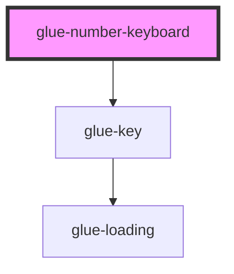

# glue-number-keyboard

<!-- Auto Generated Below -->

## Properties

| Property              | Attribute                | Description | Type               | Default            |
| --------------------- | ------------------------ | ----------- | ------------------ | ------------------ |
| `blurOnClose`         | `blur-on-close`          |             | `boolean`          | `true`             |
| `closeButtonLoading`  | `close-button-loading`   |             | `boolean`          | `undefined`        |
| `closeButtonText`     | `close-button-text`      |             | `string`           | `undefined`        |
| `deleteButtonText`    | `delete-button-text`     |             | `string`           | `undefined`        |
| `extraKey`            | `extra-key`              |             | `string`           | `''`               |
| `hideOnClickOutside`  | `hide-on-click-outside`  |             | `boolean`          | `true`             |
| `maxlength`           | `maxlength`              |             | `number`           | `Number.MAX_VALUE` |
| `modelValue`          | `model-value`            |             | `string`           | `''`               |
| `randomKeyOrder`      | `random-key-order`       |             | `boolean`          | `undefined`        |
| `safeAreaInsetBottom` | `safe-area-inset-bottom` |             | `boolean`          | `true`             |
| `show`                | `show`                   |             | `boolean`          | `undefined`        |
| `showDeleteKey`       | `show-delete-key`        |             | `boolean`          | `true`             |
| `teleport`            | `teleport`               |             | `number \| string` | `undefined`        |
| `theme`               | `theme`                  |             | `string`           | `'default'`        |
| `title`               | `title`                  |             | `string`           | `undefined`        |
| `transition`          | `transition`             |             | `boolean`          | `true`             |
| `zIndex`              | `z-index`                |             | `string`           | `undefined`        |

## Events

| Event         | Description | Type               |
| ------------- | ----------- | ------------------ |
| `blur`        |             | `CustomEvent<any>` |
| `changeValue` |             | `CustomEvent<any>` |
| `close`       |             | `CustomEvent<any>` |
| `delete`      |             | `CustomEvent<any>` |
| `input`       |             | `CustomEvent<any>` |

## Dependencies

### Depends on

- [glue-key](../glue-key)

### Graph

---

_Built with [StencilJS](https://stenciljs.com/)_
