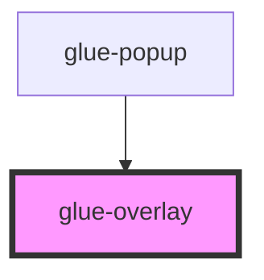

# glue-overlay

<!-- Auto Generated Below -->

## Properties

| Property      | Attribute     | Description | Type               | Default     |
| ------------- | ------------- | ----------- | ------------------ | ----------- |
| `customStyle` | --            |             | `object`           | `undefined` |
| `duration`    | `duration`    |             | `number \| string` | `undefined` |
| `lockScroll`  | `lock-scroll` |             | `boolean`          | `true`      |
| `show`        | `show`        |             | `boolean`          | `undefined` |
| `zIndex`      | `z-index`     |             | `string`           | `undefined` |

## Dependencies

### Used by

 - [glue-popup](../glue-popup)

### Graph

----------------------------------------------

*Built with [StencilJS](https://stenciljs.com/)*
