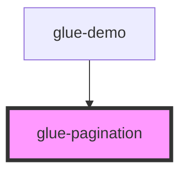

# glue-pagination

<!-- Auto Generated Below -->

## Properties

| Property        | Attribute        | Description | Type      | Default     |
| --------------- | ---------------- | ----------- | --------- | ----------- |
| `forceEllipses` | `force-ellipses` |             | `boolean` | `undefined` |
| `itemsPerPage`  | `items-per-page` |             | `number`  | `10`        |
| `mode`          | `mode`           |             | `string`  | `'multi'`   |
| `nextText`      | `next-text`      |             | `string`  | `'下一页'`     |
| `pageCount`     | `page-count`     |             | `number`  | `0`         |
| `pageText`      | `page-text`      |             | `string`  | `''`        |
| `prevText`      | `prev-text`      |             | `string`  | `'上一页'`     |
| `showPageSize`  | `show-page-size` |             | `number`  | `5`         |
| `totalItems`    | `total-items`    |             | `number`  | `0`         |
| `value`         | `value`          |             | `number`  | `0`         |

## Events

| Event        | Description | Type               |
| ------------ | ----------- | ------------------ |
| `glueChange` |             | `CustomEvent<any>` |

## Dependencies

### Used by

 - [glue-demo](../glue-demo)

### Graph

----------------------------------------------

*Built with [StencilJS](https://stenciljs.com/)*
