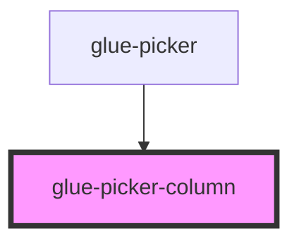

# glue-picker-column

<!-- Auto Generated Below -->

## Properties

| Property           | Attribute            | Description | Type               | Default     |
| ------------------ | -------------------- | ----------- | ------------------ | ----------- |
| `allowHtml`        | `allow-html`         |             | `boolean`          | `undefined` |
| `className`        | `class-name`         |             | `string`           | `undefined` |
| `defaultIndex`     | `default-index`      |             | `number`           | `undefined` |
| `first`            | `first`              |             | `string`           | `undefined` |
| `initialOptions`   | --                   |             | `any[]`            | `[]`        |
| `itemHeight`       | `item-height`        |             | `number`           | `undefined` |
| `readonly`         | `readonly`           |             | `boolean`          | `undefined` |
| `swipeDuration`    | `swipe-duration`     |             | `number \| string` | `undefined` |
| `textKey`          | `text-key`           |             | `string`           | `undefined` |
| `visibleItemCount` | `visible-item-count` |             | `number`           | `undefined` |

## Events

| Event        | Description | Type               |
| ------------ | ----------- | ------------------ |
| `glueChange` |             | `CustomEvent<any>` |

## Methods

### `getColumnsList() => Promise<any>`

#### Returns

Type: `Promise<any>`

### `getIndex() => Promise<number>`

#### Returns

Type: `Promise<number>`

### `getValue() => Promise<any>`

#### Returns

Type: `Promise<any>`

### `setOptions(options: any) => Promise<void>`

#### Returns

Type: `Promise<void>`

### `stopMomentum() => Promise<void>`

#### Returns

Type: `Promise<void>`

## Dependencies

### Used by

 - [glue-picker](../glue-picker)

### Graph

----------------------------------------------

*Built with [StencilJS](https://stenciljs.com/)*
